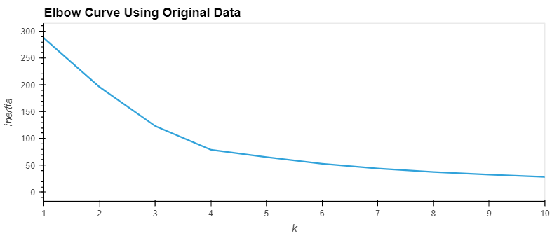
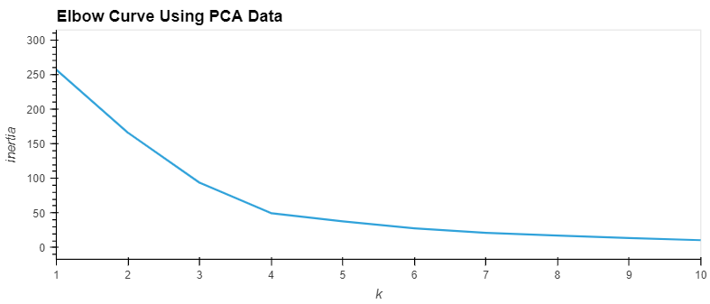

# Module-10-Challenge-Crypto-Clustering
## This repo contains my module 10 assignment. It allowed me to demonstrate my skills with the following area:
- Sklearn
- K-Means model for clustering cryptocurrencies
- PCA: Optimize clusters with Principal Component Analysis, calculate the explained variance ratio.
- StandardScaler
- Pandas: read_csv, describe, DataFrame, 
- Hvplot: Scatter, Line plot, use the plus (+) operator to visualize and compare the results
- Pathlib
- Elbow Curve to find optimal k value: k, inertia

## Data Analysis: 
After performing a principal component analysis (PCA) and reduce the features to less principal components, using fewer features to cluster the data using K-Means gives us clearer data seperation. 

Principal component analysis (PCA) is a technique for feature extraction, it helps the dimensionality reduction of the data. However it still keeps the most important features of the data, hence both elbow curves indicate the optimal vale of k to be 4.

## Implementation:

By having a clearer seperation of the clusters in the data, when inputting data of cryptocurrencies in the future, it will be much easier for the users to distinguish which cluster a cryptocurrency falls into, and they will be able to make the optimal choice to diversify their protfolios. Also, by using Principal component analysis (PCA), it saves computational resources for the users too, as it has less number of components.

